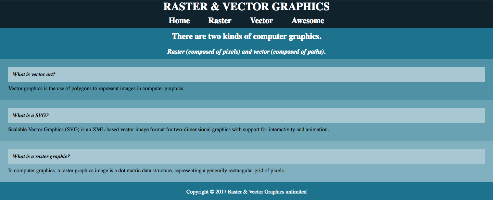

# RasterVectorSite
> A simple site providing information about raster & vector graphics.

![version][version-badge]

	https://yamilburgos.github.io/RasterVectorSite

## Meta
[Yamil Burgos](https://github.com/yamilburgos/) – yamil.burgos1293@gmail.com

## Contributing
1. Fork it (<https://github.com/yamilburgos/RasterVectorSite/fork>)
2. Create your feature branch (`git checkout -b feature/fooBar`)
3. Commit your changes (`git commit -am 'Add some fooBar'`)
4. Push to the branch (`git push origin feature/fooBar`)
5. Create a new Pull Request

<!-- Markdown link & img dfn's -->
[version-badge]: https://img.shields.io/badge/version-0.1.6-blue.svg
